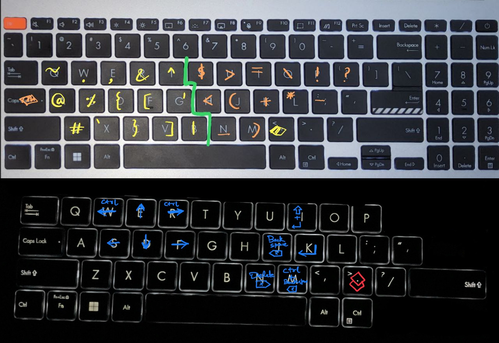

# ⌨️ Key Remapper for a Better Typing Experience

This project remaps keys to minimize hand movement and improve the touch-typing experience. By using trigger keys (`capslock`, `,`, `.`), you can access all special symbols, navigation, numpad functionality, and **mouse controls** directly from the three main alphabet rows, eliminating the need to reach for other keys (except for standard Ctrl/Shift/Alt/Win combos).

### **Core Remappings (Global)**



---

## 🟩 Installation

This key remapper is available for Windows (AutoHotkey) and Linux (Kanata or Python).

Here is the completely revamped **macOS** section. It is formatted to match the style of your Linux section, with clear steps, copy-paste terminal commands, and the specific details you requested.

You can replace your current "Kanata Setup Guide for macOS" section with this block:

---

### 🍎 macOS Method: Kanata (Recommended)

**Best for:** Native performance and deep system integration.

This configuration uses **Kanata** to mimic advanced keyboard layers. It requires the **Karabiner Driver** to inject keystrokes, but runs independently of the Karabiner app.

#### **1. Prerequisites: The Driver**

1. Download and install **[Karabiner-Elements](https://karabiner-elements.pqrs.org/)**.
2. Open the app once to ensure the extension (`Karabiner-DriverKit-VirtualHIDDevice`) is approved in **System Settings > Privacy & Security**.
3. **Critical:** Fully **QUIT** the Karabiner-Elements app (Cmd+Q) and ensure it is not running in the menu bar. We only need the *driver* installed, not the app itself.

#### **2. Quick Setup (Terminal)**

Open your terminal inside the `mac_kanata` folder of this repository and run these commands:

```bash
# 1. Install Kanata (Downloads the binary & moves it to your path)
curl -L -o kanata https://github.com/jtroo/kanata/releases/latest/download/kanata_macos_arm64
chmod +x kanata
sudo mv kanata /usr/local/bin/

# 2. Setup the Configuration Directory
mkdir -p ~/.config/kanata

# 3. Copy the config file from this folder to the config directory
cp config.kbd ~/.config/kanata/config.kbd

# 4. Run Kanata!
sudo kanata --cfg ~/.config/kanata/config.kbd

```

*Note: When you run step 4, macOS will ask for "Input Monitoring" permissions. Allow it for **Terminal** (or `kanata`), then run the command again.*

#### **3. Controls & Layers**

* **Top Row Behavior:**
* **Default:** The top row acts as **Media/Special Keys** (Brightness, Spotlight, Mission Control, Volume, etc.).
* *Note: F5 and F6 remain as standard function keys.*


* **Hold CapsLock:** The top row temporarily becomes standard **F1 - F12** keys.


* **Caps Lock Logic:**
* **Tap (<200ms):** Toggles standard Caps Lock.
* **Hold (>200ms) OR Combo:** Activates the **Symbols Layer** and transforms the top row into F-keys.
* *If you press any other key while holding Caps Lock (even for 10ms), it immediately switches to the layer.*


#### **4. Troubleshooting**

**Error: "Exclusive access and device already open"**
This means the Karabiner app is still running in the background and fighting Kanata for control. Run this command to force-kill it:

```bash
sudo pkill -9 -f karabiner

```

**How to Update Config**
If you modify the `config.kbd` file, simply press `Ctrl+C` in your terminal to stop Kanata, then run the start command again to reload it.

**⚠️ Force Quit:** If something goes wrong, press `LeftCtrl + Space + Esc` or `Ctrl+C`to instantly kill Kanata and restore your normal keyboard.

---

### 🐧 Linux Method 1: Kanata (Recommended)
**Best for:** Performance, gaming, and Online Assessments (Undetectable). Runs at the kernel level.

**Quick Setup (Fedora/Debian/Arch)**
Copy and paste this entire block into your terminal. It will download the necessary files (the app and your config) to a `~/kanata` folder and run it immediately. No git cloning required.

```bash
# 1. Create a folder to store Kanata and the Config
mkdir -p ~/kanata

# 2. Download the Kanata binary and the Configuration file
wget [https://github.com/jtroo/kanata/releases/download/v1.6.1/kanata](https://github.com/jtroo/kanata/releases/download/v1.6.1/kanata] -O ~/kanata/kanata
wget [https://raw.githubusercontent.com/riteshrajd/AHK/main/kanata/config.kbd](https://raw.githubusercontent.com/riteshrajd/AHK/main/kanata/config.kbd] -O ~/kanata/config.kbd
chmod +x ~/kanata/kanata

# 3. Setup permissions (uinput) so it runs smoothly
# (This allows Kanata to create a virtual keyboard)
sudo groupadd uinput
sudo usermod -aG uinput $USER
echo 'KERNEL=="uinput", MODE="0660", GROUP="uinput", OPTIONS+="static_node=uinput"' | sudo tee /etc/udev/rules.d/99-input.rules
sudo udevadm control --reload-rules && sudo udevadm trigger

# 4. Run it! 
# (Keep this terminal open while you want the remappings active)
sudo ~/kanata/kanata -c ~/kanata/config.kbd

```

**To Stop the script**
```bash
# Option 1: If you are looking at the running terminal
# Just press Ctrl + C on your keyboard.

# Option 2: Run this command in a NEW terminal tab to kill it instantly
sudo pkill kanata
```

### 🐧 Linux Method 2: Python Script (Legacy)

The Python script uses the `evdev` library to intercept and inject input events. Good for quick testing if you don't want to download binaries.

1. **Install the Dependency**: The script requires the `evdev` Python library.
```bash
# Fedora
sudo dnf install python3-evdev
# OR via pip (globally or in a venv)
sudo pip install evdev

```

2. **Run the Script**: Navigate to the repository folder and run the script with `sudo`:
```bash
sudo python3 key_remapper.py

```


*Note: The script must be run as root to grab the input device successfully.*
3. **(Optional) Run on Startup**: To run this automatically, you will need to create a systemd service or add a sudo-enabled command to your startup applications.


### 🪟 Windows


1. 💾 **Install AHK**: Download and install AutoHotkey from the official [AutoHotkey website](https://www.autohotkey.com/).
2. 📥 **Run the Scripts**: Download all the `.ahk` files and run them in the following order by double-clicking them:
1. `first > , . caps.ahk`
2. `then > num_pad_handling.ahk`


You are now good to go!

---

## ❓ How to Disable / Toggle

#### **Linux (Kanata)**

* Press `Ctrl+C` in the terminal window running Kanata.
* If running in background: `sudo pkill kanata`

#### **Linux (Python)**

* **To Disable**: The script runs in your terminal. simply press `Ctrl+C` to stop it safely. The keyboard will return to normal immediately.
* **If running in background**:
```bash
sudo pkill -f key_remapper.py

```


#### **Windows**

* The remappings can be toggled on and off from the Windows taskbar. Go to the system tray, right-click the green 'H' hotkey icons, and select "Pause Script" or "Exit."

---

## 🔵 Remappings

The keys `,`, `.`, and `capslock` are **trigger keys**. When you hold one of them down, the keys on the alphabet rows are remapped to new functions.

* **To use Caps Lock normally**: Press `capslock` twice within 0.2 seconds.

### **🖱️ Mouse Mode (Linux Python Only)**

*Note: Mouse mode is currently only available in the Python version of the script.*

A dedicated mode to control your cursor without leaving the keyboard.

* **Toggle ON/OFF**: Press `.` (Dot) + `u`
*(Hold Dot, tap U, release both)*

**Once Mouse Mode is Active:**

| Function | Key | Description |
| --- | --- | --- |
| **Movement** | `e`, `s`, `d`, `f` | Up, Left, Down, Right (Matches Arrow/Vim positions) |
| **Clicks** | `j` | **Left Click** |
|  | `k` | **Right Click** |
| **Scrolling** | Hold `m` | Turns `e/s/d/f` into **Scroll** Up/Left/Down/Right |
| **Speed** | (None) | Normal Speed |
|  | Hold `.` | Medium Speed / Medium Scroll |
|  | Hold `Space` | **Turbo Speed** / Fast Scroll |

*current mouse settings*

```
# Mouse Settings - Speeds (Supports decimals/floats now!)
MOUSE_SPEED_NORMAL = 1
MOUSE_SPEED_MEDIUM = 12     # Dot held
MOUSE_SPEED_FAST = 25       # Space held

SCROLL_SPEED_NORMAL = 0.2
SCROLL_SPEED_MEDIUM = 3     # Dot held
SCROLL_SPEED_FAST = 10       # Space held

```

---

### **Core Remappings (Global)**

#### **Hold `Capslock` Layer (Symbols)**

* `y` → `$` | `u` → `>` | `i` → `=` | `o` → `\` | `p` → `!`
* `h` → `<` | `j` → `(` | `k` → `+` | `l` → `*` | `;` → `-`
* `n` → `_` | `m` → `)` | `[` → `?`

#### **Hold `,` Layer (Symbols)**

* `q` → `~` | `w` → `.` | `e` → `,` | `r` → `&` | `t` → `^`
* `a` → `@` | `s` → `%` | `d` → `{` | `f` → `[` | `g` → `'`
* `z` → `#` | `x` → ` | `c` → `}` | `v` → `]` | `b` → `|`

#### **Hold `.` Layer (Navigation & Editing)**

* `k` → `Enter`
* `j` → `Backspace`
* `i` → `Shift` + `Enter`
* `m` → `Ctrl` + `Backspace` (delete word)
* `n` → `Delete`
* `e` → `Up Arrow`
* `d` → `Down Arrow`
* `s` → `Left Arrow`
* `f` → `Right Arrow`
* `r` → `Ctrl` + `Right Arrow` (next word)
* `w` → `Ctrl` + `Left Arrow` (previous word)

#### **Hold `.` then hold `,` Layer (Numpad)**

*First hold down `.`, and while holding it, also hold down `,` to activate this layer.*

* `w` → `7` | `e` → `8` | `r` → `9`
* `s` → `4` | `d` → `5` | `f` → `6` | `g` → `0`
* `x` → `1` | `c` → `2` | `v` → `3`
* `a` → `,` | `z` → `.`

### **✨ Linux Extras**

* `Capslock` + `f` → `Alt` + `Tab` (App Switcher)
* `Capslock` + `d` → `Alt` + `Shift` + `Tab` (App Switcher Reverse)
* `.` + `h` → **Delete Whole Line**

```